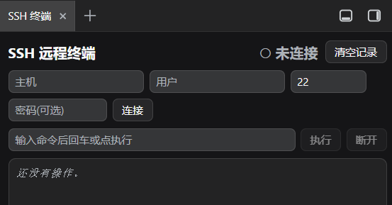

# dsh-ssh-terminal

🌏 [English](README_EN.md) · [中文](README.md)

SSH 远程终端：在 `dsh-better-sidebar` 侧边栏里连接远程主机，**逐步查看 agent 输入的命令和输出**，不影响对话主流程；同时为 Agent 提供 SSH 工具。



## 功能

- **Better-sidebar「SSH 终端」tab**：右侧栏 `+` 菜单里出现，点击即打开面板，含连接表单 + 命令输入 + **实时命令→输出转录**（带时间戳、颜色跟随 DSH 皮肤）。
- **Agent 工具**（独立可用）：`ssh_connect` / `ssh_exec` / `ssh_disconnect` / `ssh_status`。
- **记录持久化**：本机会话内跨重启保留（写盘到 `~/.dsh/ssh-terminal-history.json`），面板右上角「清空记录」可手动清空。

## 依赖

- DSH web（`dsh web` / DSH Desktop）
- `dsh-better-sidebar`（>= 0.12.0）——**只有「侧边栏面板」需要它**；Agent 的 SSH 工具不依赖 better-sidebar，单独装本插件即可用。

> **可选增强**：未安装 better-sidebar 时，本插件只提供 Agent 的 SSH 工具（模型可连接、执行、断开，结果在对话里看到）；不显示侧边栏「SSH 终端」面板。

## 安装

```sh
dsh plugin add github:sunzhyang1616-ui/dsh-ssh-terminal
```

装完**硬刷新浏览器**（Cmd/Ctrl+Shift+R）即可（Client 改动无需重启；仅 Host 改动才需重启 DSH）。

## 本地安装（源码 / link 方式）

```text
1. 让 profile 使用本包：编辑 ~/.dsh/profiles/<profile>/package.json 的 dependencies 加入
   "dsh-ssh-terminal": "link:<本目录绝对路径>"
2. 挂载 bundle patch（package.json 已声明 "dsh": { "bundle": { "patch": "./cordis.patch.yml" } }）
3. 在 profile 目录执行 pnpm install
4. 硬刷新浏览器（Cmd/Ctrl+Shift+R）
```

## 文件说明

| 文件 | 说明 |
| --- | --- |
| `lib/index.js` | **Host 半**：启动 `ssh -tt`、维护转录、注册工具 + `/ssh-terminal/api` HTTP 路由 |
| `lib/client.js` | **Client 半**：`ctx.betterSidebar.registerTab` 注册「SSH 终端」tab + 实时转录 UI |
| `src/client/index.tsx` | Client 源码（tsdown 构建入口） |
| `tsdown.config.ts` | client 构建配置 |
| `cordis.patch.yml` | bundle 挂载补丁 |

## 限制 / 说明

- SSH 连接为 Host 进程态，DSH 重启即断（连接不自动重连）；**操作记录**会本机落盘、跨重启保留。
- 密码仅本次调用内使用，不回显、不写入转录；推荐 `identity`（私钥文件）认证。
- 若目标 DSH 版本对已安装插件不暴露 `harness`，Host 已改用 `ctx.tools.register` + `webServer` 路由，无需 `harness`。
